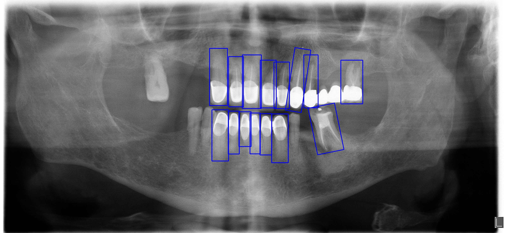

# Guiding Neural Networks Towards Better Decisions

This repository contains the implementation, experiments, and dataset details for the paper "Guiding Neural Networks Towards Better Decisions".

The paper is currently under review.

## AU-OPG Dataset

Through this work, we publish the AU-OPG Dataset. The dataset consists of panoramic radiographs annotated for two tasks: dental diagnosis and dental treatment planning. Each radiogaph includes bounding box annotations for the target teeth, with alignment (orientation) information provided.

You can find the dataset and relevant information here: [pending paper acceptance].

**Sample Radiograph:**



## Repository Structure

```
├── src/
│   ├── detection/
│   │   └── [Jupyter notebooks for detection experiments]
│   │── classification/
│   │   └── [Jupyter notebooks for classification experiments]
│   └── dataset_preprocessing
│       └── [Jupyter notebooks for dataset preprocessing]
└── README.md
```

## Getting Started

### Prerequisites

- Python 3.8+
- Jupyter Notebook
- Required dependencies (see individual notebooks for specific requirements)

### Installation

1. Clone the repository:

```bash
git clone https://github.com/akvnn/guiding-neural-nets
cd guiding-neural-nets
```

2. Install libraries if needed

### Usage

3. Navigate to the relevant folder and run the Jupyter notebooks:

```bash
# For classification experiments
cd src/classification
jupyter notebook

# For detection experiments
cd src/detection
jupyter notebook
```

## Citation

If you use the dataset or code in your research, please cite our paper:

[pending paper acceptance]
